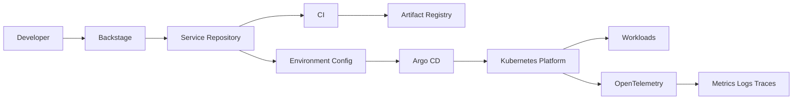

# Platform Engineering Reference

A reference architecture for a Kubernetes-based internal platform using **GitOps, self-service and observable-by-default workloads**.

## Architecture



## Principles

- Git is the desired-state source of truth.
- Platform APIs expose paved roads without hiding infrastructure reality.
- Self-service should reduce cognitive load, not remove ownership.
- Workloads are observable by default.
- Security and policy are platform capabilities.
- Production readiness is part of the delivery path.

## Repository layout

```text
backstage/       example catalog entity
gitops/          Argo CD ApplicationSet example
platform/base/   baseline Kubernetes resources
platform/overlays/
docs/            architecture and ADRs
```

The manifests are intentionally small so architectural choices remain easy to inspect.
